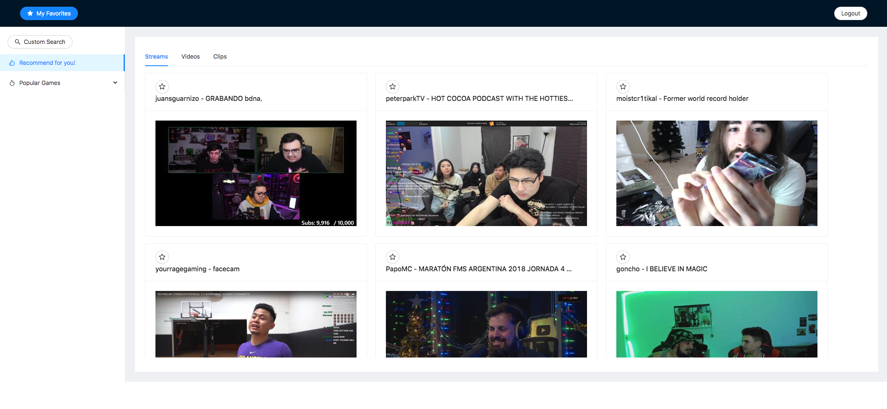

# jupiter

### Overview of Jupiter Application

Jupiter is a Personalized Twitch Resources Recommendation Engine. It allows user to create account, 
search Twitch resources including video, stream and clip. Users can also login and add resources to "Favorite".
 The application provides recommendation based on user's favorite games or the top games if no favorite.
 The recommendation uses Content-Based algorithm.
 
### The deployed application

Visit the Jupiter Application at [http://18.206.209.109:80](http://18.206.209.109:80) and explore it.
